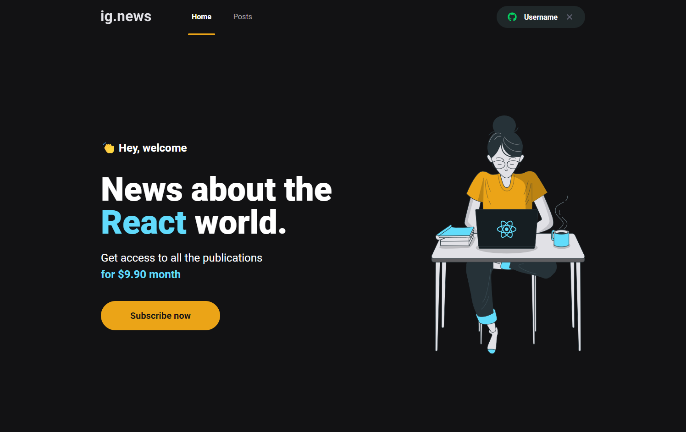

    

    <small>Project by Rocketseat - Developed by Leonardo Meira</small>

# <strong>Overview</strong>

    

O <strong>ig.news</strong> é um projeto pertencente ao Capítulo III da Trilha React do curso Ignite, realizado pela Rocketseat.
Concebido como um portal de notícias para desenvolvedores React, o objetivo principal de seu desenvolvimento é ensinar e/ou embasar os conhecimentos na ferramenta <strong>Next.js</strong>.

# <strong>Conceitos abordados:</strong>

### • SSR - Server-side Rendering  
### • SSG - Static Site Generation  
### • Integração com API de pagamentos (Stripe)